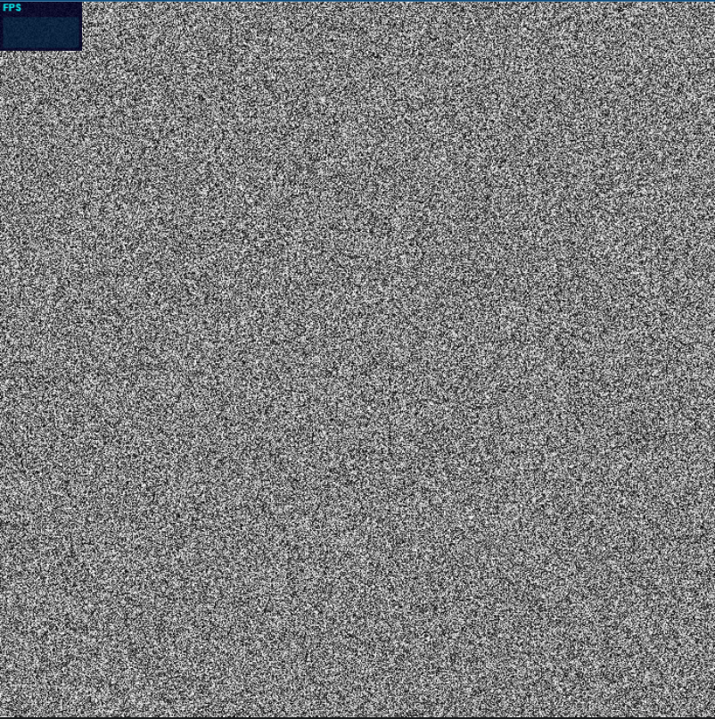

# WebGPU Path Tracer - Part 1

[Code Link](https://github.com/Shridhar2602/WebGPU-Path-Tracer)

[Live demo](./path_tracer/index.html) 

Warning - It requires a reasonably powerful GPU and a web browser with WebGPU support enabled.

<div align="center">
  <p align="center">
  
  
  
  </p>
</div>

[WebGPU Path Tracer - Part 2](./part2.md)

[WebGPU Path Tracer - Part 3](./part3.md)

[WebGPU Path Tracer - Part 4](./part4.md)

## Goal

For our Advanced Computer Graphics course project, we decided to build our own Path Tracer from ground zero. Surprisingly, building a path tracer is not that complex. There’s even a [Monte Carlo Path Tracer written in just 99 lines of C++](https://www.kevinbeason.com/smallpt/), generating a picture of a Cornell Box. So we first need to set some goals - 

- We want our ray tracer to be real-time.
- We don’t want to just make another toy ray tracer capable of rendering only parametric shapes. There exist tons of such really cool shaders on [Shadertoy](https://www.shadertoy.com/).
- A ray tracer that can handle small meshes, maybe a few thousand triangles, would be a solid starting point.
- Building a good ray tracer involved two key aspects: improving the render quality and enhancing performance. We’ll begin by setting up a bare bones path tracer with basic materials. Then optimizing it to run really fast, and finally add other fancy effects.

## Ray Tracing vs. Path Tracing

The difference between ray tracing and path tracing is rather difficult to understand. There is not much material out there and googling it produces frustratingly confusing results. So, here is our understanding of it.

Ray tracing and Path tracing are just different ways of approximating the result of the [Rendering Equation](https://en.wikipedia.org/wiki/Rendering_equation) : the “color” of a pixel is the integral of all the light falling into it. The difference lies in how they select (sample) rays from the infinite set of possible rays.

Ray tracing (technically recursive ray tracing), sends one single ray through each pixel until it it hits a surface. At this point, additional rays may be casted; a reflection ray if the surface is reflective; a refracted ray if the surface is transparent; and a ray towards each light source to calculate the illumination. Its important to note here that ray tracing does not provide physically accurate results. It “only” gives us reflections, refractions and hard shadows. Just like a rasterizer has to *cheat* to achieve reflections and refractions, a ray tracer has to *cheat* to get photo-realistic effects like caustics, soft shadows and global illumination (indirect lighting).

Now, path tracing on the other hand, is like ray tracing on steroids. It *naturally* simulates all these fancy effects. It starts the same, by casting a ray through each pixel. However, instead of tracing a path to each light source, it simply bounces the ray off the surface and keeps bouncing it until it either hits a light source or a predefined bounce limit is reached. It then recursively calculates the amount of light transferred back to the pixel, considering all material information from surfaces along the way. Exactly how light works in reality. The only catch is that this leads to very noisy images as most of the pixels fail to find any light source. So, instead of sending a single ray, a path tracer sends out tens of thousands of rays for each pixel. Each ray follows a random path and the results of all these paths are averaged to calculate the pixel’s color.

What we are doing here is path tracing. It is faithful to reality but *painfully* slow. Achieving real-time performance may require the use of its more efficient variants like bidirectional path tracing, Volumetric path tracing, and Metropolis light transport. Now that we know what path tracing is, let’s take a moment to appreciate Nvidia’s recent breakthrough: [Real-time path tracing in AAA games](https://www.youtube.com/watch?v=3wR7jR1pIQQ).

NOTE : For the sake of simplicity, we will use the terms ray tracing and path tracing interchangeably throughout this post.

## Why WebGPU?

Ok, so next up we needed decide on a programming language. Almost all high-quality professional path tracers, like Pixar’s RenderMan, run on CPUs. That makes sense because large and complex scenes require a lot of memory and GPUs have limited VRAM. But we want real-time performance and we’re okay with small scenes, so we will do ray tracing on a GPU. 

Instead of sticking with our good old OpenGL, or modern Graphics APIs like Vulkan and DirectX, we decided to go with WebGPU. It is a relatively new standard, but it has a cool advantage of running on a web browser. WebGPU is being hailed as the future of web graphics, and it supports modern features like compute shaders which WebGL lacks. It is also very easy to setup and will eventually run on all types of systems ([WebGPU API - Compatibility Guide](https://developer.mozilla.org/en-US/docs/Web/API/WebGPU_API#browser_compatibility)).

## A Minimal Ray-Tracer

We started by following Peter Shirley’s wonderful [Ray Tracing in One Weekend Series](https://raytracing.github.io/). It’s fairly easy to understand, well paced and includes code snippets in C++. All we need to do is port it to WebGPU, which is not as straightforward as it sounds because GPUs specialize in doing simple operations really fast which means that code optimized for CPU won’t necessarily translate to GPU efficiency. Furthermore, most shaders still don’t support recursive calls, which is a problem because ray-tracing in inherently a recursive operation. 

Here, we won’t be going into details on the math and physics behind ray-tracing because there’s no way we can do a better job than Peter Shirley. Instead, we’ll focus on the implementation details & challenges we faced when implementing ray-tracing on WebGPU.

Lastly, we followed [WebGPU Fundamentals](https://webgpufundamentals.org/) to set up a basic WebGPU pipeline. For now we don’t want to go into optimizing WebGPU for performance, though we do plan to do so later. 

## Code structure

We currently have a multi-shader setup with a two-pass system -

- 1st pass (compute shader) : does the ray-tracing and stores the final color in a buffer.
- 2nd pass (vertex + fragment shader) : renders the final colors on the screen.

It is technically possible to do everything in a fragment shader. However, compute shaders gives us control over how work is distributed in a GPU. Currently, a single compute shader handles everything, but we plan to split it into multiple shaders, which can improve performance.

## Shooting rays

In order to shoot rays from the camera to each pixel, we first need to convert the pixel coordinates from **raster space** to **screen space.** 

In a compute shader, we only have access to the `global_invocation_index` , which we can think of as a linear id of each pixel (actually, `global_invocation_index` is not a built-in, so we must first calculate it. [WebGPU Compute Shader Basics](https://webgpufundamentals.org/webgpu/lessons/webgpu-compute-shaders.html) is an excellent resource on how compute shaders work).

Given the screen dimensions, we can easily convert the linear pixel index to the raster space (a 2D space with (0,0) being the top-left corner) -

```rust
let fragCoord = vec3f(f32(i) % screenDims.x, f32(i) / screenDims.x, 1);
```

The z-coordinate is fixed as 1 since our projection plane is fixed at (0, 0, 1). Now, we can convert these to the screen space -

```rust
let aspect = screenDims.x / screenDims.y;
let pixel_x = aspect * (2 * (fragCoord.x / width) - 1) 	// [ranges from -aspect to +aspect]
let pixel_y = -(2 * (fragCoord.y / height) - 1)			// [ranges from +1 to -1]
```

In rasterization, the camera remains fixed at the origin and we use a world-to-view matrix (typically called `viewMatrix`) to transform the world to the camera space, where all calculations are carried out. However, in ray tracing, it is more convenient to work in world space. So, we transform the ray to the world space using the inverse of the `viewMatrix`.

The following function takes the pixel coordinates, computes the ray from the camera to the pixel, and transforms it to the world space:

```rust
fn camera_get_ray(s : f32, t : f32) -> Ray {

	let origin = (invViewMatrix * vec4f(0, 0, 0, 1)).xyz;   // projection plane fixed at (0,0,1)
	let dir = (invViewMatrix * vec4f(vec3f(s, t, -fovFactor), 0)).xyz;
	var ray = Ray(origin, dir);

	return ray;
}
```

Now, we can shoot this ray into the scene.

NOTE : Peter Shirley doesn’t use any matrices in his implementations. We don’t really have to because there are many ways to describe the transformation due to an arbitrarily positioned camera. However, for us, it is more efficient to precompute a `viewMatrix` , rather than computing it for each pixel in a shader.

## Generating random numbers

Our path tracing algorithm is technically referred to as *Monte Carlo* Path Tracing. Monte Carlo methods rely on randomness to estimate solutions to complex problems. For example, to reduce aliasing, we sample the light falling *around* a pixel by randomly shooting rays around the pixel center and averaging the results. The more samples per pixel (spp), the less noisy the final image becomes. Later on, we will also try to integrate more advanced Monte Carlo methods like Importance Sampling.

So, we need a good pseudo-random number generator (PRNG) or hash function because shaders don’t come with a built-in random number generator. PRNGs use a seed value to mathematically generate random numbers. For each pixel, our initial seed will simply be its index, which is linear. Therefore, a good PRNG should produce uniformly distributed random numbers even for highly correlated seeds. Also, it should be *really* fast. A high quality but slow PRNG can significantly slow down our ray tracer.
<div align="center">
  <p align="center">
    
  	
  </p>
  <p align="center">
  <sub>XorShift and PCG</sub>
	</p>
</div>

After trying a bunch of PRNGs ([Hash Functions for GPU Rendering](https://www.shadertoy.com/view/XlGcRh)), we settled down on the 1D seed version of [PCG](https://en.wikipedia.org/wiki/Permuted_congruential_generator) as our random number generator. It is very fast, the quality is good enough for us and it updates the seed inside it for generating the next random number.

```rust
fn rand2D() -> f32 
{
	randState = randState * 747796405u + 2891336453u;
	let word : u32 = ((randState >> ((randState >> 28u) + 4u)) ^ randState) * 277803737u;
	return f32((word >> 22u)^word) / 4294967295;
}
```

## Generating Random Directions

To model diffuse surfaces, we need to generate random directions, which is the same as generating random points on the surface of a sphere. A simple approach used by Peter Shirley is to keep generating random points within a cube until one of these falls inside a sphere. We can then normalize it to obtain a random direction.

```rust
fn random_in_unit_sphere() -> vec3f {
    while true {
        let p = vec3f(rand2D() * 2 - 1, rand2D() * 2 - 1, rand2D() * 2 - 1);
        if(length(p) < 1) {
            return normalize(p);
        }
    }
}
```

However, a while loop in a shader may not be a good idea. Although this loop should run only twice on average, it will sometimes get stuck if we run it millions of times. Having threads potentially executing different numbers of loop iterations can result in poor GPU performance.

Luckily for us, there are alternative approaches. We can select spherical coordinates randomly to generate points on the surface of a unit sphere. As it of course turns out, the obvious way of doing this is not the correct way, as described in [Sphere Point Picking](https://mathworld.wolfram.com/SpherePointPicking.html).


```rust
fn random_in_unit_sphere() -> vec3f {
    let phi = rand2D() * 2.0 * PI;
    let theta = acos(2.0 * rand2D() - 1.0);

    let x = sin(theta) * cos(phi);
    let y = sin(theta) * sin(phi);
    let z = cos(theta);

    return vec3f(x, y, z);
}
```

Another quite interesting way is to use a gaussian-distributed random function instead of a uniform one to generate random vectors as demonstrated in [3].

At this point, we are ready to render a simple Cornell box. 

<div align="center">
  <p align="center">
  
  </p>
</div>
<p align="center">
  <sub>Cornell Box - 1000 samples per pixel & 5 max depth</sub>
</p>


## Progressive Rendering

Even at 1000spp, the above image looks quite noisy and it takes almost 2 seconds to render. Above 1000spp, our browser flat out crashes. The only way we can get a less noisy image (at least for now), is to keep the samples per pixel low and average the results from previous frames.

```rust
let fragColor = rayTrace();   // get the color buffer from this pass

// average it with the previous color buffer
let weight = 1.0 / (frameNum + 1);
let accFragColor = framebuffer[i].xyz * (1 - weight) + fragColor * weight;
```

We also need our rays to bounce differently each frame, so we need to modify our random number seed such that it changes every frame. 

```rust
let randState = i + u32(frameNum) * 719393;
```

Now we can continually render at 60fps, with our image getting better with time.

<div align="center">
  <p align="center">
  
  </p>
</div>

[Next up](./part2.md), ray tracing triangular meshes using BVH!

## References

[1] [Ray Tracing in One Weekend Series](https://raytracing.github.io/)

[2] [Path Tracing vs Ray Tracing - Dusterwald.com](https://www.dusterwald.com/2016/07/path-tracing-vs-ray-tracing/)

[3] [Coding Adventure: Ray Tracing - Sebastian Lague](https://www.youtube.com/watch?v=Qz0KTGYJtUk&t=1615s)

[4] [https://webgpufundamentals.org/](https://webgpufundamentals.org/)