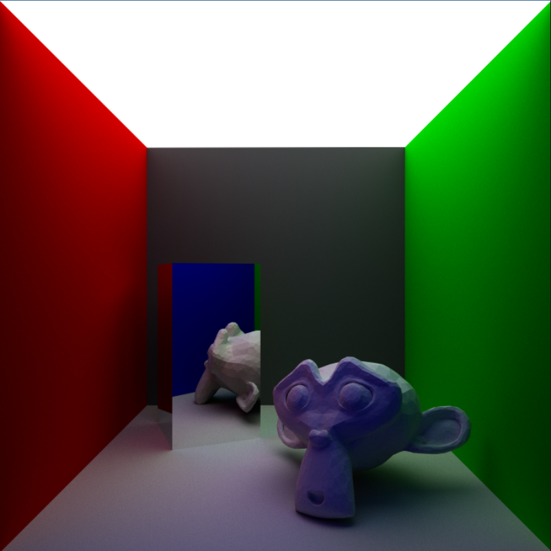
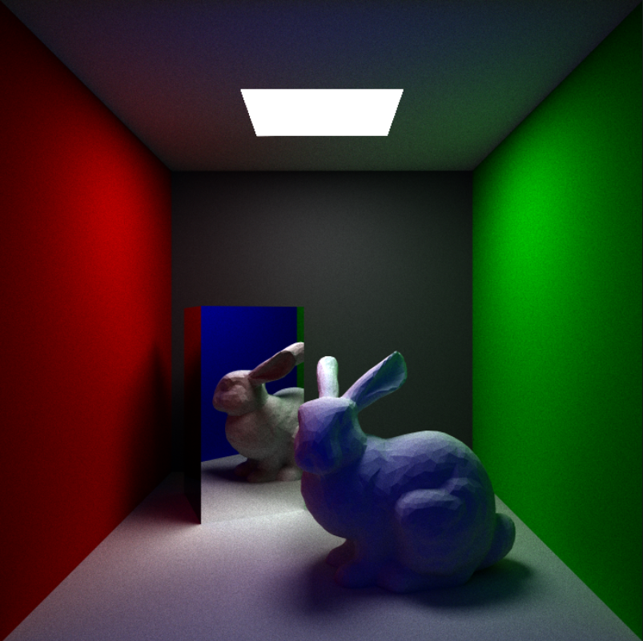
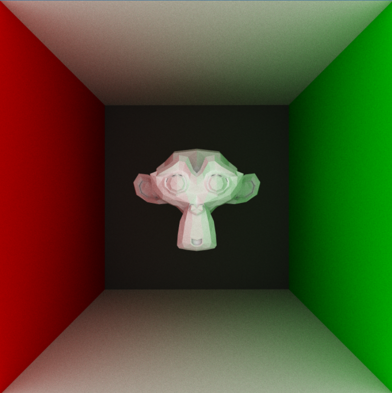

# WebGPU Path Tracer - Part 2

In the [previous](./index.md) post, we built a real-time path tracer capable of rendering basic parametric shapes. Now let’s move on to the serious stuff, rendering meshes. We’ll try loading `.obj` files to our path tracer and focus on an acceleration structure to speed things up: Bounding Volume Hierarchies.

<div align="center">
  <p align="center">
  
  
  </p>
</div>

## Rendering a Mesh

For ray-triangle intersection, we’re using the [Möller-Trumbore algorithm](https://www.scratchapixel.com/lessons/3d-basic-rendering/ray-tracing-rendering-a-triangle/moller-trumbore-ray-triangle-intersection.html). It’s a fast, minimum storage algorithm with the added advantage of giving us the barycentric coordinates of a triangle for free. Barycentric coordinates can be used to interpolate vertex data across the triangle’s surface. For example, if we have per-vertex normal data, then we can interpolate it to simulate smooth shading.

Once we have ray-triangle intersection implemented, loading `.obj` files is pretty straightforward.

Meet Suzanne, the Blender Monkey -

<div align="center">
  <p align="center">
  
  </p>
</div>

## Adding Transformations

Before we move on to BVH, let’s quickly add support for transforming objects. We want to translate, rotate and scale (and that too non-uniformly) our models. 

In rasterization, linear transforms are represented by a model matrix, `M`, which is used to transform the vertices of a model from object space to world space. In ray tracing, we can’t really do that - we sometimes don’t have vertices because parametric shapes are represented through equations. So, it makes more sense to transform the ray to object’s local space for intersection tests.

Since we are transforming in the opposite direction, i.e. from world space to object space, we can use the inverse of the model matrix to transform our ray.

```rust
let origin_os = (invModelMatrix * vec4f(incidentRay.origin, 1)).xyz;
let dir_os = (invModelMatrix * vec4f(indidentRay.dir, 0)).xyz;
let ray_os = Ray(origin_os, dir_os);
```

For the ray origin (position), we set the fourth coordinate to 1, and for the ray direction (vector), we set the fourth coordinate to 0 (vectors don’t need to be translated). Also, inverse is a costly operation, so we precompute and store it for each mesh.

We also need to transform the normals by the normal matrix, which is basically the inverse transpose of the model matrix.

```
hitRec.normal = tri.normalA * w + tri.normalB * u + tri.normalC * v;
hitRec.normal = (transpose(invModelMatrix) * vec4f(hitRec.normal, 0)).xyz;
```

What about the intersection value, `t` ? Since we perform the intersection test in object space, the intersection point we obtain is also in object space. However, we need it to be in world space because we do everything else in world space. We can calculate the world space intersection value, `t’` by simply transforming the intersection point back to world space using the model matrix (not inversed), and then recalculating the intersection value.

But there is a simpler way. We can avoid this extra work by simply not normalizing the ray direction after transforming it, which, if you noticed, we haven’t done. Generally, we want our direction vectors normalized, but in this specific case, everything just works out.

Now, we can effortlessly create instances of our objects and position them as needed.

<div align="center">
  <p align="center">
  
  </p>
</div>
<p align="center">
  <sub>1000 triangles at 1spp and 4 max depth</sub>
</p>


## Acceleration Structures

The Suzanne mesh contains 968 triangles, and it takes ~150ms to render one frame. Painfully slow and hardly real-time. We are aiming for 60fps, which is ~16.6ms per frame.

So where is the bottleneck? Let’s examine our hit function which checks for ray-object intersection:

```rust
fn hit(ray : Ray) -> bool
{
	var closest_so_far = MAX_FLOAT;
	var hit_anything = false;

	for(var i = 0; i < NUM_TRIANGLES; i++)
	{
		if(hit_triangle(triangles[i], 0.00001, closest_so_far, ray)) 
		{
				hit_anything = true;
				closest_so_far = hitRec.t;
		}
	}

	for(var i = 0; i < NUM_SPHERES; i++)
	{
		if(hit_sphere(sphere_objs[i], 0.00001, closest_so_far, ray))
		{
				hit_anything = true;
				closest_so_far = hitRec.t;
		}
	}

	for(var i = 0; i < NUM_QUADS; i++)
	{
		if(hit_quad(quad_objs[i], 0.00001, closest_so_far, ray))
		{
				hit_anything = true;
			closest_so_far = hitRec.t;
		}
	}

	return hit_anything;
}
```

Notice that we are checking for ray intersection with *all* objects in the scene. And this function is called `max_depth` number of times, for every pixel on the screen. Let’s calculate the number of ray-primitive intersection tests for the above scene containing 1000 triangles at 4 `max_depth`, rendered at 700x700 resolution.

$$
(700\times700)\times1000\times4 =1,960,000,000
$$

That’s 1.96 billion intersection tests *per* frame. An absurd amount of computation for our GPU, considering that ray-primitive intersection tests are not at all cheap. Every other computation we are doing pales in comparison. 

Okay, so we know the bottleneck. We can’t really make our ray-primitive intersection code any faster, Möller-Trumbore algorithm is one of the fastest out there. The only other option is to drastically reduce the number of such tests.

## A Simple Acceleration Structure - AABB

One simple approach is to define bounding-boxes for each primitive. Instead of brute-force checking all primitives, we will first check if the ray hits their bounding boxes. If it does not, we can safely skip those primitives. As long as our ray-bounding box intersection test is *very* fast, we are in profit.

Bounding Boxes can be of many types. We will go with the simplest, but still pretty tight fitting axis-aligned bounding box, **AABB.** In 3D, an AABB is simply a cuboid with faces parallel to the three coordinate planes.

The following code defines an AABB, and checks if a ray intersects it. This code is branchless and works extremely well.

```rust
struct AABB {
	min : vec3f,
	max : vec3f,
}

fn hit_aabb(box : AABB, ray : Ray) -> bool {
	let invDir = 1 / ray.dir;
	
	var tbot = (box.min - ray.origin) * invDir;
	var ttop = (box.max - ray.origin) * invDir;
	var tmin = min(ttop, tbot);
	var tmax = max(ttop, tbot);
	var t = max(tmin.xx, tmin.yz);
	var t0 = max(t.x, t.y);
	t = min(tmax.xx, tmax.yz);
	var t1 = min(t.x, t.y);

	return t1 > max(t0, 0.0);
}
```

Using bounding boxes will improve our performance, but it will still not be enough. Bounding Boxes are not tight enough a fit for large meshes, and we are still iterating over all primitives. This is why AABBs are often used hierarchically with data-structures like oct-trees, k-d trees and bounding volume hierarchies.

## Bounding Volume Hierarchy (BVH)

There are many families of acceleration structures, each with their pros and cons. The idea behind all of them is the same. Currently, our ray-object intersection time is linear with the number of objects. We can improve this time to logarithmic by somehow dividing the scene. Two common ways are to either divide the space or to divide the objects. A BVH follows the latter by creating a hierarchy (tree) of bounding boxes, which can then be traversed in log(n) time.

Okay, so what we can do is pick some BVH library, integrate it with our BVH and call it a day. That sounds boring though, so we will try to implement a simple BVH on our own.

Integrating a BVH has two steps : Building it and traversing it.  For dynamic real-time scenes, we will need to build a new BVH every frame. Too slow for CPU so we will need to build one using multiple compute shaders on the GPU. Our limited experience tells us that would quickly become a nightmare to debug, so let’s stick with static scenes for now. We will build a BVH with JavaScript and then pass it to WebGPU.

## Building a BVH

To create a BVH, we will follow [Ray Tracing: The Next Week](https://raytracing.github.io/books/RayTracingTheNextWeek.html#quadrilaterals/interiortestingoftheintersectionusinguvcoordinates). The idea is to first create bounding boxes for each primitive, then create a binary tree. All primitives reside on leaf nodes and a BVH’s efficiency depends on how we divide the primitives into two branches. A very naive approach is -

1. Randomly choose an axis
2. sort the primitives
3. put half in each subtree

The following code creates a BVH using recursion:

```jsx
static generate_bvh_heirarchy(objs, start, end) {

	// pick an axis
	let axis = Math.floor(Math.random() * 3);
	let comparator = (axis == 0) ? BVH.box_x_compare : (axis == 1) ? BVH.box_y_compare : BVH.box_z_compare;

	let obj_span = end - start;

	let node = new BVH();

	// if leaf node, assign objects bounding box to the node
	if(obj_span == 0) {
		node.obj = objs[start]
		node.bbox = node.obj.bbox;
	}

	else {
		const subarray = objs.slice(start, end + 1); 
		subarray.sort(comparator);
		objs.splice(start, subarray.length, ...subarray);

		let mid = start + Math.floor(obj_span / 2);
		node.left = BVH.generate_bvh_heirarchy(objs, start, mid);
		node.right = BVH.generate_bvh_heirarchy(objs, mid + 1, end);

		node.bbox.merge_bbox(node.left.bbox, node.right.bbox);
	}

	return node;
}
```

## Traversing a BVH

It is not easy to traverse a tree in a shader, so we will first flatten it and traverse it using skip pointers. You can read more about this approach [here](https://stackoverflow.com/questions/55479683/traversal-of-bounding-volume-hierachy-in-shaders). Once we flatten it and send it to the GPU, we can modify our hit function:

```rust
fn hit2(ray : Ray) -> bool
{
	var closest_so_far = MAX_FLOAT;
	var hit_anything = false;

	var i = 0;
	while(i < NUM_AABB && i != -1) {
		
		if(hit_aabb(bvh[i], ray)) {

			let t = i32(bvh[i].prim_type);
			switch t {
				case 0: {
					if(hit_sphere(sphere_objs[i32(bvh[i].prim_id)], 0.00001, closest_so_far, ray)) {
						hit_anything = true;
						closest_so_far = hitRec.t;
					}
				}

				case 1: {
					if(hit_quad(quad_objs[i32(bvh[i].prim_id)], 0.00001, closest_so_far, ray)) {
						hit_anything = true;
						closest_so_far = hitRec.t;
					}
				}

				case 2: {
					if(hit_triangle(triangles[i32(bvh[i].prim_id)], 0.00001, closest_so_far, ray)) {
						hit_anything = true;
						closest_so_far = hitRec.t;
					}
				}

				default: {}
			}

			i++;
		}
		else {
			i = i32(bvh[i].skip_link);
		}
	}

	return hit_anything;
}
```

Essentially, we check if the ray intersects with a node first. If it doesn’t then we can skip it’s subtree. 

And just like that, we are back to real-time.


<div align="center">
  <p align="center">
  
  </p>
</div>
<p align="center">
  <sub>6000 triangles</sub>
</p>

Our path tracer can now handle about 6000 triangles in real-time. There is an annoying bug in our BVH implementation which doesn’t allow us to render larger meshes. And we’ll have to modify our code to handle multiple instances of large meshes. We will skip these performance upgrades for now, and next up focus on improving the quality of our renders.

## References

[1] [Ray-Tracing: Rendering a Triangle (scratchapixel.com)](https://www.scratchapixel.com/lessons/3d-basic-rendering/ray-tracing-rendering-a-triangle/barycentric-coordinates.html)

[2] [Graphics Compendium - Transformations](https://graphicscompendium.com/raytracing/12-transformations)

[3] [05_transformation_hierarchy.pdf (mit.edu)](http://groups.csail.mit.edu/graphics/classes/6.837/F03/lectures/05_transformation_hierarchy.pdf)

[4] [Ray Tracing: The Next Week](https://raytracing.github.io/books/RayTracingTheNextWeek.html#quadrilaterals/interiortestingoftheintersectionusinguvcoordinates)

[5] [Introduction to Acceleration Structures (scratchapixel.com)](https://www.scratchapixel.com/lessons/3d-basic-rendering/introduction-acceleration-structure/introduction.html)

[6] [glsl - Traversal of Bounding Volume Hierachy in Shaders - Stack Overflow](https://stackoverflow.com/questions/55479683/traversal-of-bounding-volume-hierachy-in-shaders)