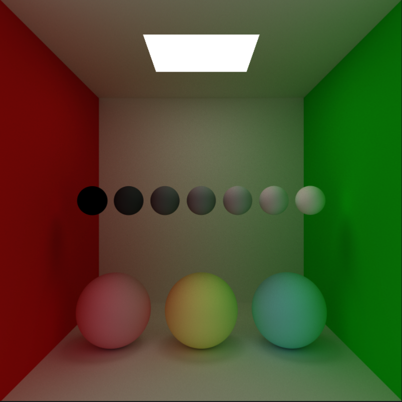
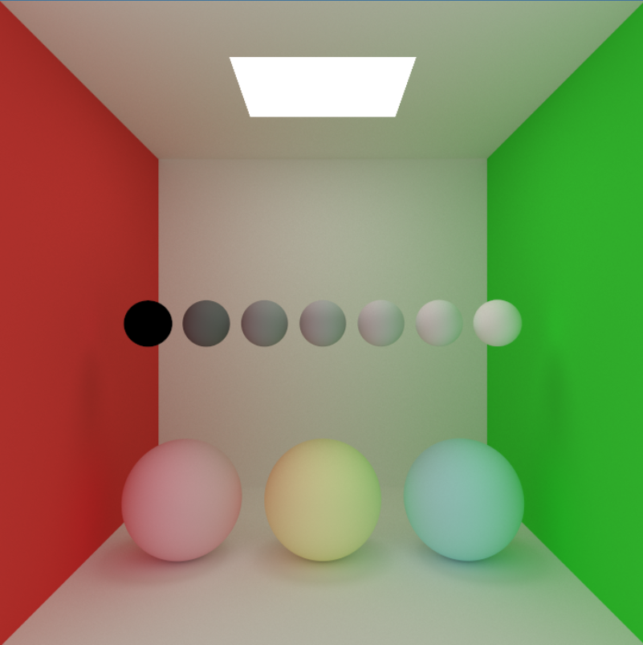
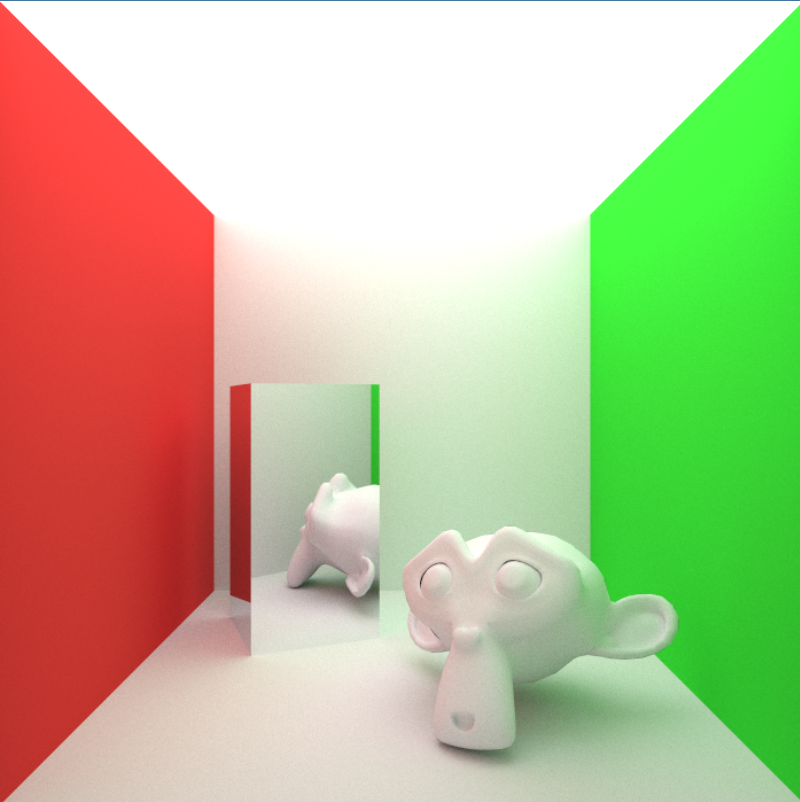
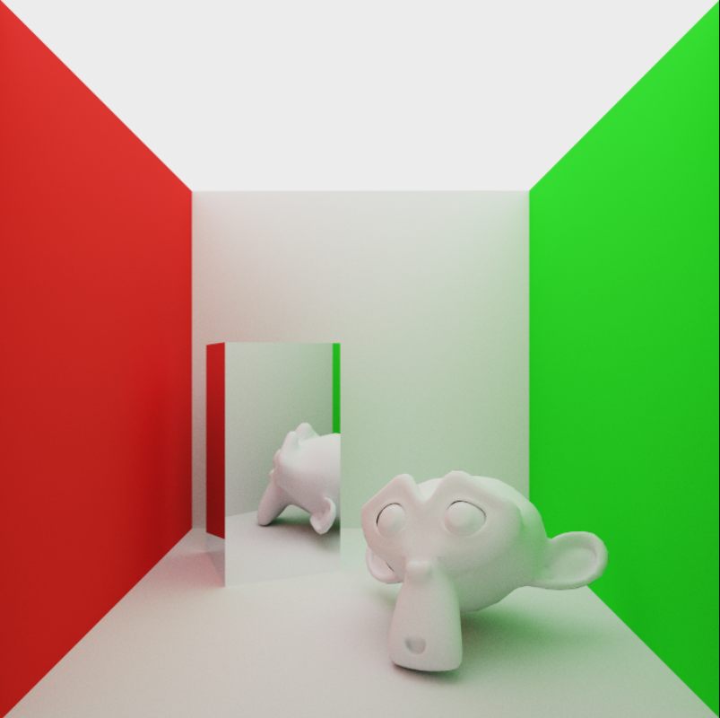
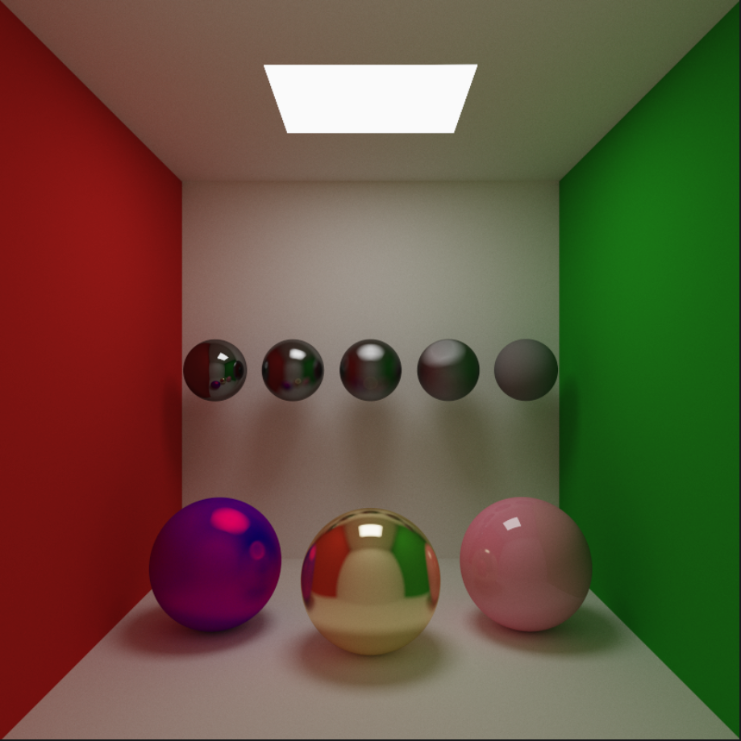
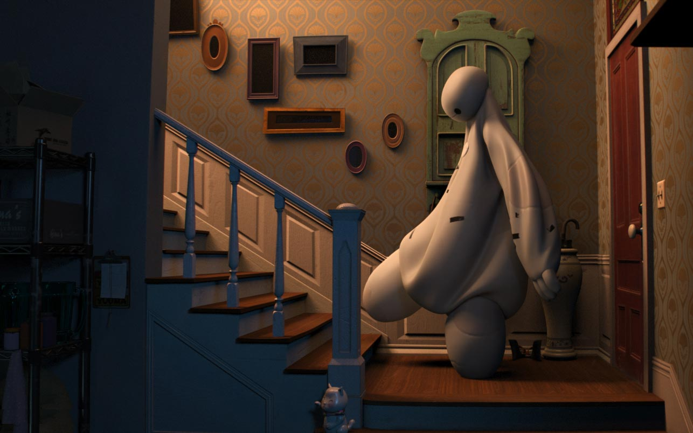
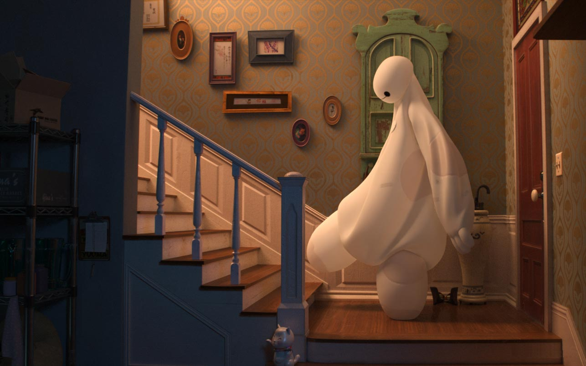
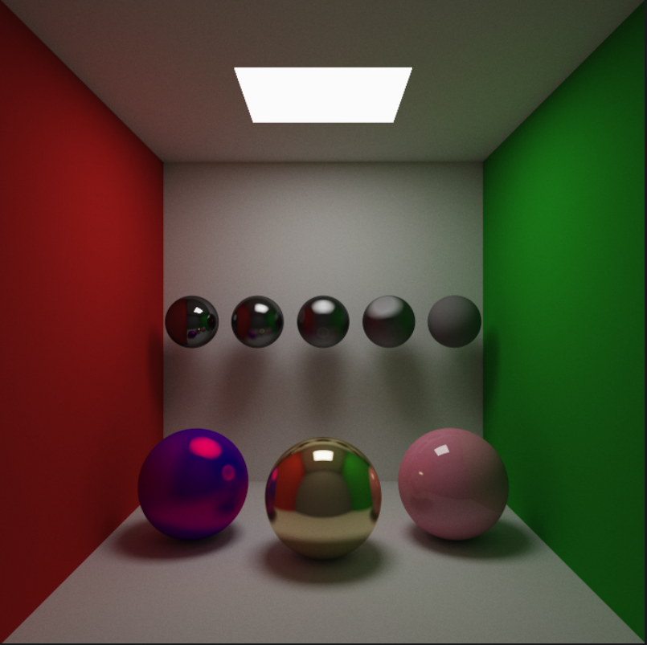
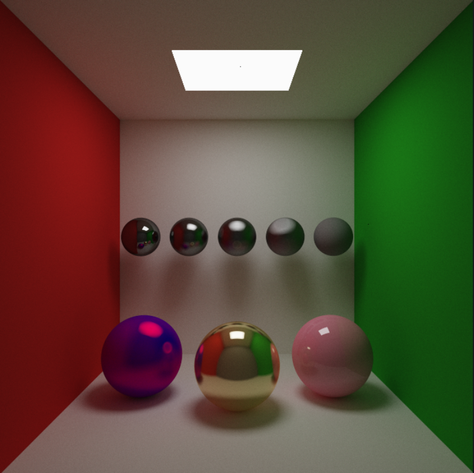

# WebGPU Path Tracer - Part 3

Since we are interested in high-quality rendering, we want to display as accurate as possible colors. Now, we don’t want to fall into the rabbit hole of color theory. For hard-core physically based renders, we would have to convert our renderer from RGB to Spectral. That would honestly be too much for our first path tracer, so, let’s stick with RGB for now.

## RGB to sRGB with Gamma Correction

Proper gamma correction is probably the easiest, and most inexpensive technique for improving image quality.

Light transport is linear, which means that illumination contribution from two sources in a scene will *sum*. That’s why we use the linear RGB color space for all our calculations. However, most monitor displays use the non-linear sRGB color space because of their physical properties (twice the input voltage does not result in twice the amount of brightness). This happens to also closely match how human beings measure brightness. Our vision is not linear. 

What this essentially means is that our monitor applies a non-linear transform to our output colors by raising the pixel values to the power of *gamma*. So, we need to apply the inverse of this transformation, i.e. raise pixel values to 1/*gamma* before sending them to the framebuffer. Note that we also need to convert from sRGB to RGB whenever we read a texture, because most images are stored in sRGB format.

There is no global gamma value; it is different for every monitor. However, 2.2 is a close approximation. For performance, we can also apply `sqrt()` assuming the gamma value to be 2.0.

```rust
// fragment shader
@fragment fn fs(@builtin(position) fragCoord: vec4f) -> @location(0) vec4f {
	...
	// return fragColor.xyz    // without gamma correction
	return pow(fragColor.xyz, vec3f(1/2.2));    // with gamma correction
}
```

<div style="display:flex">
     <div style="flex:1; text-align: center;">
         <figure>
				
				  <figcaption align="center"><em>Without Gamma Correction</em></figcaption>
		</figure>
     </div>
     <div style="flex:1; text-align: center">
	 		<figure>
				
				  <figcaption align="center"><em>With Gamma Correction</em></figcaption>
			</figure>
     </div>
</div>


The colors in our gamma-corrected render look washed out. This is a natural consequence of gamma correction.  Not having gamma correction might give a more vibrant look, but it also makes it impossible to accurately color grade our results. If we add two lights together, the result should be twice as bright, but without gamma correction the result will look closer to 4.5x as bright. We can always adjust our lighting and colors to get a more “punchy” look, even after gamma correction.

Also, notice the greyscale ramp without gamma correction. The middle sphere is clearly not halfway between black and white. It is more like 70% grey. The gamma corrected greyscale ramp, on the other hand, is perfectly linear.

[GPU Gems 3 : Chapter 24. The Importance of Being Linear](https://developer.nvidia.com/gpugems/gpugems3/part-iv-image-effects/chapter-24-importance-being-linear)  and [LearnOpenGL - Gamma Correction](https://learnopengl.com/Advanced-Lighting/Gamma-Correction) are some excellent resources for further reading on Gamma Correction.

## Tone Mapping

Since we are using 32-bit floats in all our calculations, the output of our renderer can range from $[0,\infin]$. So, our renderer outputs in HDR (High Dynamic Range). Sounds cool, but most monitors out there don’t currently support HDR, meaning they are capable of displaying RGB values in the range of $[0,255]$  only. Tone Mapping is the process of mapping HDR values in $[0,\infin]$ into LDR values in $[0,1.0]$  or $[0, 255]$. 

We are already using a trivial and quite flawed Tone Mapping function `clamp(color, 0, 1)`. The consequence of this is that parts of our image would go 100% white and we would lose a lot of detail.  A good tone mapper preserves details in dark areas, while also making areas which are too bright have recognizable detail. There is no “best” or “correct” tone mapper. It depends on the look we are aiming for. An extensive comparison of various tone mapping functions can be found [here](https://graphics-programming.org/resources/tonemapping/index.html#:~:text=Put%20simply%2C%20tone%20mapping%20is,%5B0%2C1.0%5D). We will use an approximated ACES fit by Krzysztof Narkowicz.

```rust
//https://knarkowicz.wordpress.com/2016/01/06/aces-filmic-tone-mapping-curve/):
fn aces_approx(v : vec3f) -> vec3f
{
    let v1 = v * 0.6f;
    const a = 2.51f;
    const b = 0.03f;
    const c = 2.43f;
    const d = 0.59f;
    const e = 0.14f;
    return clamp((v1*(a*v1+b))/(v1*(c*v1+d)+e), vec3(0.0f), vec3(1.0f));
}
...
@fragment fn fs(@builtin(position) fragCoord: vec4f) -> @location(0) vec4f {
...
	fragColor = aces_approx(fragColor.xyz);
	fragColor = pow(fragColor.xyz, vec3f(1/2.2));
}
```

<div style="display:flex">
     <div style="flex:1; text-align: center;">
         <figure>
				
				  <figcaption align="center"><em>Without Tone Correction</em></figcaption>
		</figure>
     </div>
     <div style="flex:1; text-align: center">
	 		<figure>
				
				  <figcaption align="center"><em>With Tone Correction</em></figcaption>
			</figure>
     </div>
</div>

Notice how the top edge of the back wall is much sharper after tone mapping. The colors of the walls are also more saturated, like in a HDR display. 

>⚠️ It’s important to keep in mind that we must do *every* calculation in linear space. Earlier, we were applying gamma correction to the output of our compute shader, which was being stored in a framebuffer for blending with next frame. It lead to incorrect results because we were unintentionally blending in a non-linear space. 
>Apply tone-mapping and gamma correction in the fragment shader just before sending it to the displaybuffer and store the original linear values for blending.


## Glossy Reflections

Our renderer currently supports diffuse, mirror, and dielectric materials. The only thing missing is specular reflections for metallic materials.

We will add `specularStrength` and `specularColor` to our material struct.

```ruby
struct Material {
	color : vec3f,			// diffuse color
	specularColor : vec3f,	// specular color
	emissionColor : vec3f,	// emissive color
	specularStrength : f32,	// chance that a ray hitting would reflect specularly
	roughness : f32,		// diffuse strength
	eta : f32,				// refractive index
	material_type : f32,
}
```

Our shading process works like this:

- An incoming ray will reflect specularly with probability `specularStrength`.
- A diffuse ray will scatter in a random direction (following the cosine-weighted random sampling we did in part 1).
- A specular ray will interpolate between the diffuse and specular directions using the `roughness` of the surface.

```rust
if(hitRec.material.material_type == LAMBERTIAN)
	{
		doSpecular = select(0.0, 1.0, rand2D() < hitRec.material.specularStrength);

		var diffuse_dir = random_on_hemisphere(hitRec.normal);
		if(near_zero(diffuse_dir)) {
			diffuse_dir = hitRec.normal;
		}
		var specular_dir = reflect(ray_in.dir, hitRec.normal);
		specular_dir = normalize(mix(specular_dir, diffuse_dir, hitRec.material.roughness));

		scattered = Ray(hitRec.p, mix(diffuse_dir, specular_dir, doSpecular));
	}
...
acc_color *= attenuation * mix(hitRec.material.color, hitRec.material.specularColor, doSpecular);
```

Here’s a scene showing off our new specular highlights -

<div style="display:flex">
     <div style="flex:1; text-align: center;">
         <figure>
				
		</figure>
     </div>
</div>


The grey balls are fully specular with varying roughness. The left big ball has a diffuse color of pure blue, and specular color of pure red, with 0.5 specular strength and 0.4 roughness. Of course, nothing like this can exist in real world, but it shows what happens when we mix diffuse and specular colors. The middle one is supposed to be made of gold, and the right one is perfectly smooth with 0.1 specular strength.

## Russian Roulette

We currently have a hard limit on the number of times a ray bounces. This actually makes our renderer biased, because in order to be completely mathematically unbiased, a ray should keep bouncing *forever.* But this is not practical, so we must instead focus on reducing this bias due to hardcoded `max_bounces`.

There is no obvious way to decide the number of bounces. For most scenes, after a certain number of bounces, the contribution to the final color becomes minimal. Some scenes might look great after 3-4 bounces; others might take up to 15 or 20.

<div style="display:flex">
     <div style="flex:1; text-align: center;">
         <figure>
				
				  <figcaption align="center"><em>2 bounces</em></figcaption>
		</figure>
     </div>
     <div style="flex:1; text-align: center">
	 		<figure>
				
				  <figcaption align="center"><em>9 bounces</em></figcaption>
			</figure>
     </div>
</div>

One way is to have no limit on number of bounces; instead terminate rays after their contribution falls below some threshold. But again, how do we choose this threshold? If it’s too large, the image will become biased, too small, and we’re wasting time. Russian Roulette is a way to probabilistically terminate low-contribution paths without introducing systemic bias.

In Russian Roulette, we select some termination probability `p` . This value can be chosen in almost any manner. We can then terminate rays with probability p. However, we can’t just stop here; to account for this *lost energy*, we have to boost the energy of non-terminated paths by `1/p`.

We can choose our termination probability based on the throughput (or accumulated color). This way, paths with low throughput that won’t contribute much are more likely to be terminated. 

```rust
let p = max(acc_color.x, max(acc_color.y, acc_color.z));
if(rand2D() > p) {
	break; 
}

acc_color *= (1.0 / p);
```

The proof that Russian Roulette does not introduce bias is actually very simple. Suppose that F is some random variable such that -

$$
F = F_1+F_2+\dots+F_N
$$

In Russian Roulette we basically replace each term with:

$$
F_{i}'=\begin{cases}
\frac{1}{p_i}F_i & \text{with probability } p_i \\
0 & \text{otherwise}
\end{cases}
$$

Then, 

$$
E[F_i'] = p_i \times \frac{1}{p_i}E[F_i] + (1-p_i)\times 0 = E[F_i]
$$

Note that the value of *p* doesn’t really matter. Russian Roulette also never reduces variance (i.e. noise), it is just improves efficiency. However, poorly chosen Russian Roulette weights can substantially increase variance. 

Here’s our scene rendered at 5 `max_depth` without Russian Roulette, and at 10,000 *`max_depth`* with Russian Roulette.

<div style="display:flex">
     <div style="flex:1; text-align: center;">
         <figure>
				
				  <figcaption align="center"><em>5 bounces without Russian Roulette</em></figcaption>
		</figure>
     </div>
     <div style="flex:1; text-align: center">
	 		<figure>
				
				  <figcaption align="center"><em>10,000 bounces with Russian Roulette</em></figcaption>
			</figure>
     </div>
</div>

10,000 depth is ridiculous and totally unnecessary. The improvement in image quality would be negligible after 15-20 bounces (Russian Roulette will optimally decide this for us). Remarkably, we can run it at 60fps. Even at low bounce limits, Russian Roulette gives a huge performance boost by terminating low-contribution paths.

Next up, [Importance Sampling!](./part4.md)

## References

[1] [Chapter 24. The Importance of Being Linear | NVIDIA Developer](https://developer.nvidia.com/gpugems/gpugems3/part-iv-image-effects/chapter-24-importance-being-linear)

[2] [Tone Mapping | Graphics Programming Resources (graphics-programming.org)](https://graphics-programming.org/resources/tonemapping/index.html#:~:text=Put%20simply%2C%20tone%20mapping%20is,%5B0%2C1.0%5D)

[3] [Casual Shadertoy Path Tracing 2: Image Improvement and Glossy Reflections « The blog at the bottom of the sea (demofox.org)](https://blog.demofox.org/2020/06/06/casual-shadertoy-path-tracing-2-image-improvement-and-glossy-reflections/)

[4] [monte carlo - Is Russian Roulette really the answer? - Computer Graphics Stack Exchange](https://computergraphics.stackexchange.com/questions/2316/is-russian-roulette-really-the-answer)

[5] [Russian Roulette and Splitting (pbr-book.org)](https://www.pbr-book.org/3ed-2018/Monte_Carlo_Integration/Russian_Roulette_and_Splitting)