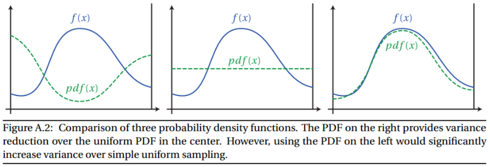
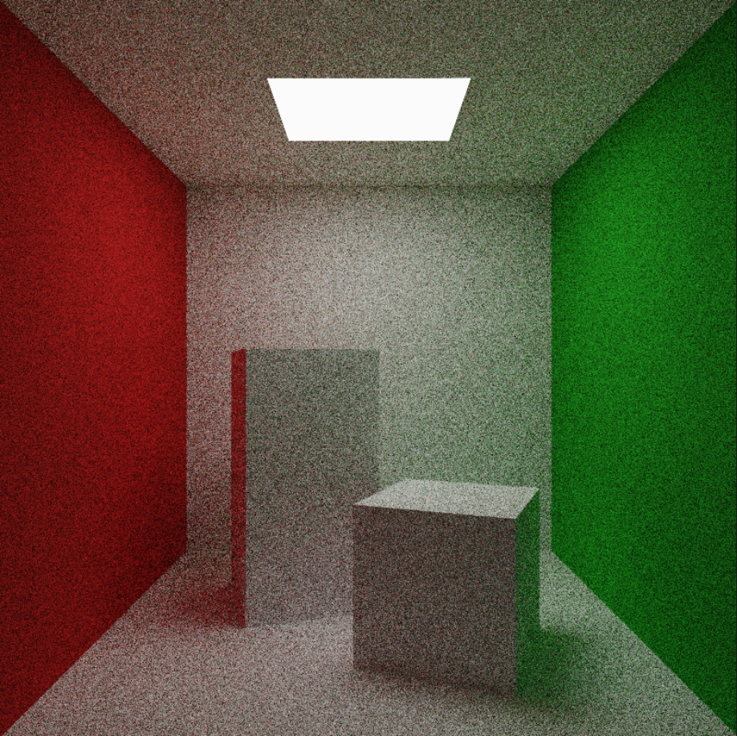
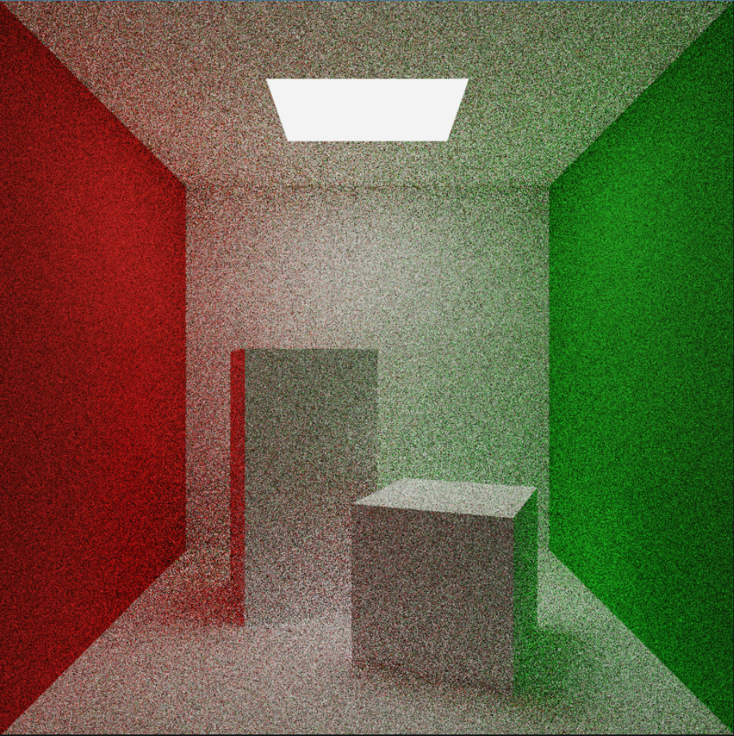
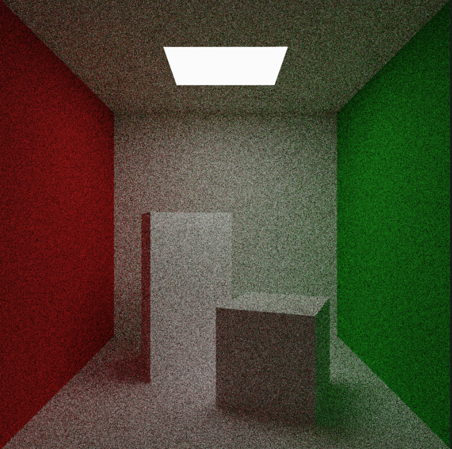
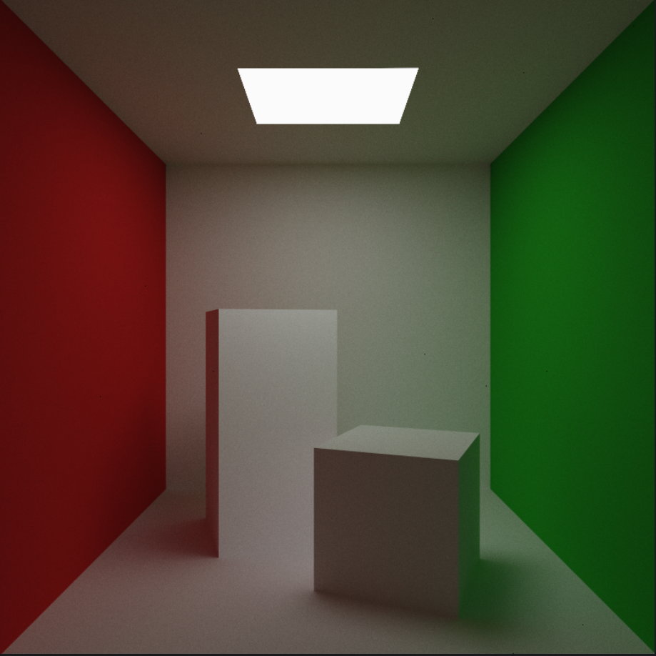
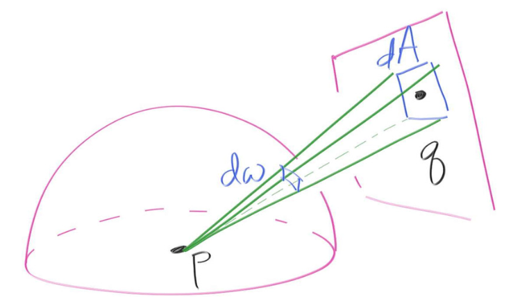
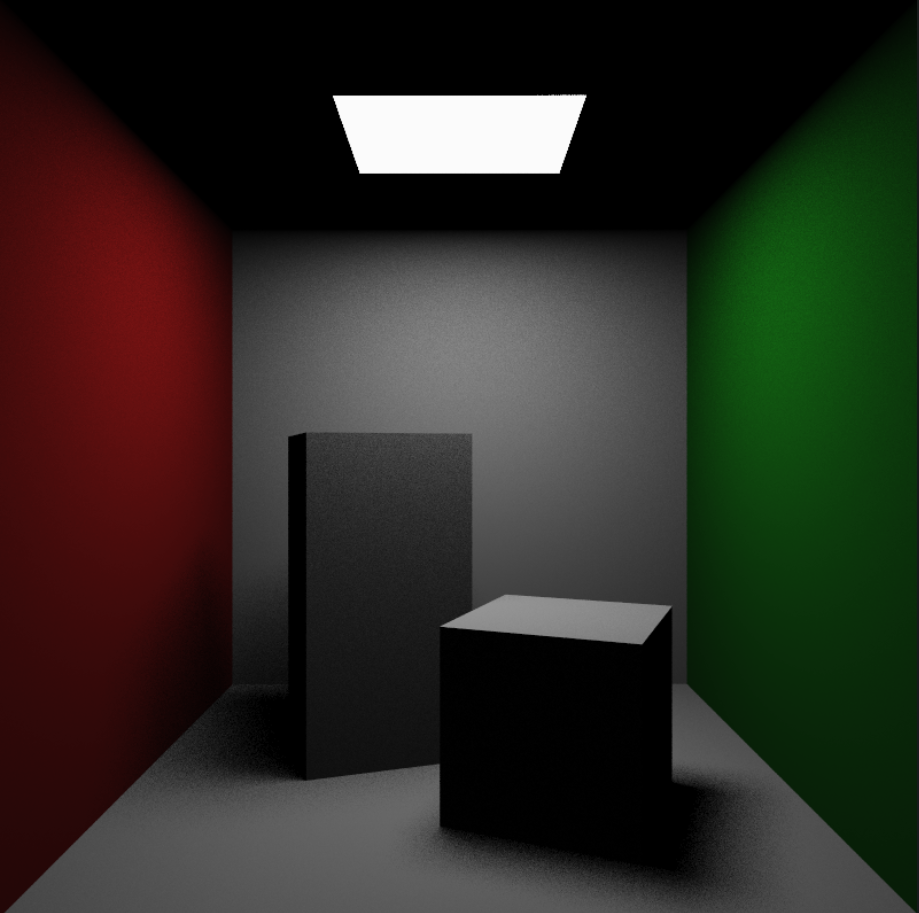
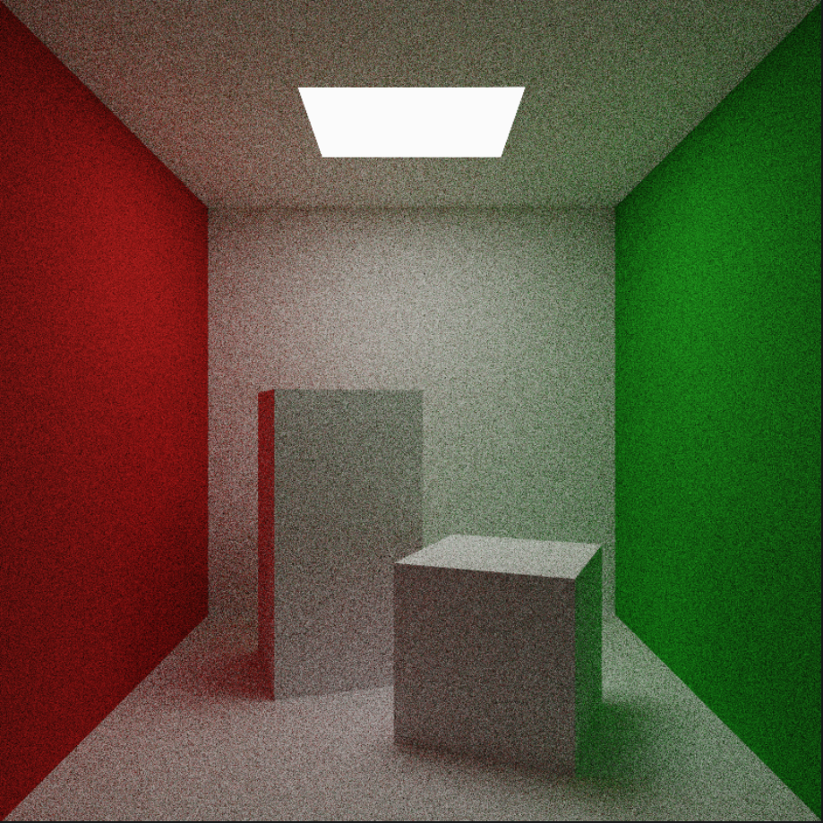
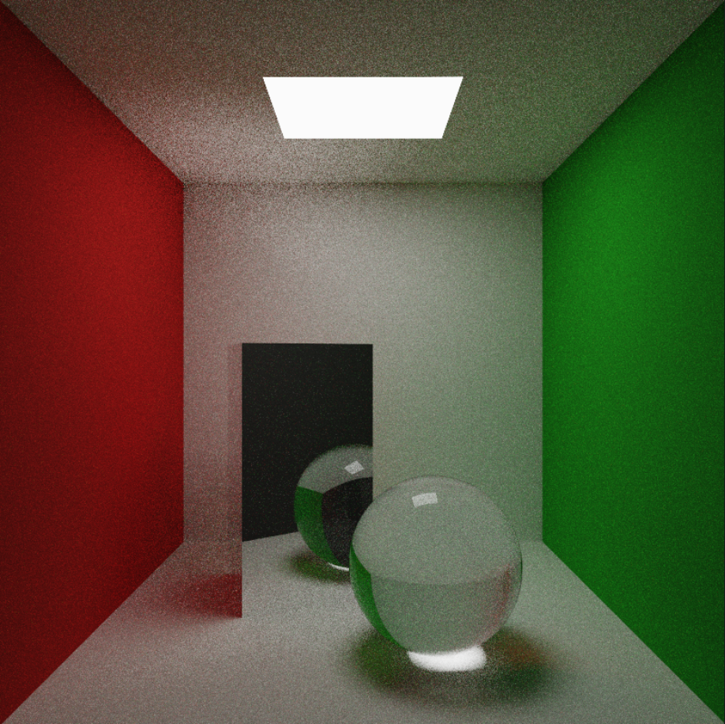

# WebGPU Path Tracing - Part 4

Basic path tracing is a simple method. Its main problem though is noise (variance), a consequence of the use of Monte Carlo methods. The get rid of it, all we can do is to increase the number of samples N, which is not a trivial task, because to reduce the noisy by two, we need four times as many samples (exponential increase). In Part 2, we implemented a BVH to render a lot of triangles in real-time. However, it doesn’t allow us to render more than 1 sample-per-pixel each frame.

<p align="center">
  <blockquote>
    <p style="font-size: larger;">"Ray Tracing is not slow - computers are"<br>
    - <em style="font-size: smaller;">Kajiya</em></p>
  </blockquote>
</p>

Our render is still very noisy. So can we reduce variance by any other means than waiting for computers to get faster? Why is there so much noise? Because most of the paths fail to find any light source. Can we somehow send more light rays toward light sources to make our render less noisy, without biasing our render? Importance Sampling does just that. 

## Importance Sampling

Importance Sampling is a Monte Carlo method and a fairly complex one. Monte Carlo methods are integral to the field of rendering, and are connected to many very important topics such as sampling, importance sampling, and light transport algorithms like Metropolis. In order to understand these, it is essential to first build a very strong mathematical foundation in probability and statistics theory, which is beyond the scope of this post. We recommend going through [Mathematical Foundations of Monte Carlo Methods (scratchapixel.com)](https://www.scratchapixel.com/lessons/mathematics-physics-for-computer-graphics/monte-carlo-methods-mathematical-foundations/quick-introduction-to-monte-carlo-methods.html) for a good understanding of the math. For now, we will try to give a basic introduction to Importance Sampling.

Monte Carlo integration is essentially a technique to estimate the value of an integral -

$$
\int f(x) dx \approx \frac{1}{N}\sum_{i=1}^{N}\frac{f(x_i)}{pdf(x_i)}
$$

It says that we can approximate an integral by averaging a lot of random samples from the function. $pdf(x_i)$ represents the probability density function of each random sample. If you don’t understand PDFs, just remember that we can generate random numbers that follow various distributions, such as uniform or normal distribution.

Importance Sampling takes advantage of the fact that the Monte Carlo estimator converges more quickly if the samples are taken from a distribution PDF that is similar to the function $f(x)$. 

<figure>
	
	<figcaption align="center"><em>Wojciech Jarosz's<a href="https://cs.dartmouth.edu/~wjarosz/publications/dissertation/appendixA.pdf"> Dissertation, Appendix A</a></em></figcaption>
</figure>

In simple terms, instead of generating samples uniformly, we generate more samples where the function is likely to be important. Note that we are still generating samples randomly. We can’t just create samples where the function is important; if we start deciding where to put the samples rather than randomly generating them, the theory of Monte Carlo will fall apart. 

Let’s see how we can apply importance sampling to path tracing.

## Scattering Rays with Importance Sampling

One example of importance sampling in Path Tracing is how to choose the direction of a ray after it hits a surface. For diffuse surfaces, the outgoing ray can be anywhere in a unit hemisphere. 

The simplest way is to uniformly sample the hemisphere to generate the new ray. However, we can exploit the fact that the [Rendering equation](https://en.wikipedia.org/wiki/Rendering_equation#:~:text=In%20computer%20graphics%2C%20the%20rendering,and%20James%20Kajiya%20in%201986.) has a cosine factor in it -

$$
L_o(x,w_o,\lambda,t) = L_e(x, w_o, \lambda, t) + \int_{\Omega} f_r(x, w_i,w_o,\lambda,t)\cdot L_i(x, w_i,\lambda,t)\cdot|cos\theta_i|dw_i
$$

All this time, we were just trying to solve estimate this integral. The cosine factor indicates that rays at the horizon hold less weightage, meaning that we can lower variance and reduce noise by generating rays according to a cosine weighted hemisphere, instead of a uniform one. Such a diffuse surface is called a *Lambertian* surface. In fact, our diffuse surface is already a Lambertian, and we have been doing this importance sampling all along, without realizing it. 

The above Rendering Equation notation is terribly confusing, so in order to follow along with our code, we will use this simplified notation from Peter Shirley’s [Ray Tracing: The Rest of Your Life](https://raytracing.github.io/books/RayTracingTheRestOfYourLife.html#mixturedensities/themixturepdfclass) -

$$
\text{Color}_o(x,w_o,\lambda) = \int_{w_i}\text{Albedo}(\dots)\cdot\text{ pScatter(\dots)}\cdot\text{Color}_i(\dots) 
$$

Here, Albedo represents the fraction of light a surface absorbs. $\text{pScatter}$ is the scattering PDF. We can approximate the color of the surface using Monte Carlo integration -

$$
\text{Color}_o(\dots)\approx\sum\frac{A(\dots)\cdot \text{pScatter}(\dots)\cdot \text{Color}_i(\dots)}{p(\dots)}
$$

$p$ is the PDF of whatever outgoing direction we randomly generate. Usually in literature, reflection is defined by the famous *Bidirectional Reflectance Distribution Function* (BRDF) -

$$
\text{BRDF}(w_i,w_o,\lambda)=\frac{A(x,w_i,w_o,\lambda)\cdot pScatter(x,w_i,w_o,\lambda)}{cos(\theta_o)}
$$

So, in terms of BRDF, our formula becomes - 

$$
\text{Color}_o(\dots)\approx\sum\frac{\text{BRDF}(\dots)\cdot \text{Color}_i(\dots)\cdot cos(\theta_o)}{p(\dots)}
$$

By changing pScatter or BRDF, we can fundamentally change the material of our surfaces. However, if we change the PDF, our material will remain the same but it may take more or less samples to converge. 

Let’s see the code to get a better understanding of what all this means.

## Lambertian Importance Sampling

For a Lambertian surface, pScatter is proportional to the cosine density, $cos(\theta_o)$, where $\theta_o$ is the angle relative to the surface normal - 

$$
\text{pScatter}(w_o) = \frac{cos(\theta_o)}{\pi}
$$

We’ll skip the proof of how the $\pi$ factor came in; it’s a constant we can calculate by integrating over a hemisphere. 

```rust
fn lambertian_scattering_pdf(scattered : Ray) -> f32 {
	let cos_theta = max(0, dot(hitRec.normal, scattered.dir));
	return cos_theta / PI;
}
```

We’ll also need to sample rays from a cosine-weighted hemisphere. As mentioned above, we are already doing this. Here’s the code -

```rust
fn cosine_sampling_hemisphere() -> vec3f {
	return uniform_random_in_unit_sphere() + hitRec.normal;
}
```

Adding the normal vector to a uniformly distributed unit vector has the effect of biasing the sampling vector towards the surface normal, which is the same as cosine weighting.

$p$  is also equal to the scattering PDF, so they cancel out and we get what we were doing all along - 

```rust
acc_light += emissionColor * acc_color;
acc_color *= 1 * hitRec.material.color;
```

We will now modify the above to make the importance sampling explicit - 

```rust
let scattering_pdf = lambertian_scattering_pdf(scattered);
let pdf = scattering_pdf;

acc_light += emissionColor * acc_color;
acc_color *= (1 * scattering_pdf * hitRec.material.color) / pdf;
```
<div style="display:flex">
     <div style="flex:1; text-align: center;">
         <figure>
				
				  <figcaption align="center"><em>Lambertian Sampling - 100 samples per pixel</em></figcaption>
		</figure>
     </div>
</div>


One might wonder what’ the point of this? Well, since our code is now generalized, we can try different non-trivial scatterings, like sending more-rays towards the light.

But first, let’s see what happens if we change the PDF from perfect match to a different one. We’ll continue to have our rays weighted by a Lambertian, but let’s use a uniform PDF in the denominator.

```rust
let scattering_pdf = lambertian_scattering_pdf(scattered);
let pdf = 1 / (2 * PI);

acc_light += emissionColor * acc_color;
acc_color *= (1 * scattering_pdf * hitRec.material.color) / pdf;
```

At 100 spp we get -

<div style="display:flex">
     <div style="flex:1; text-align: center;">
         <figure>
				
				  <figcaption align="center"><em>Lambertian Scattering with perfect PDF</em></figcaption>
		</figure>
     </div>
     <div style="flex:1; text-align: center">
	 		<figure>
				
				  <figcaption align="center"><em>Lambertian Scattering with imperfect PDF (Brightness adjusted)</em></figcaption>
			</figure>
     </div>
</div>

It maybe hard to see, but the right image is more noisier. Look at the top crease of the back wall and the bottom of our blocks! 

## Uniform Sampling

Let’s try the uniform scattering distribution. This time we are changing the inherent nature of our diffuse objects, from Lambertian to Uniform, so the outcome of our renderer should be *materially* different. 

```rust
// var diffuse_dir = cosine_sampling_hemisphere();
var diffuse_dir = uniform_sampling_hemisphere();
...
fn uniform_scattering_pdf(scattered : Ray) -> f32 {
	return 1 / (2 * PI);
}
...
let scattering_pdf = uniform_scattering_pdf(scattered);
let pdf = 1.0 / (2 * PI);

acc_light += emissionColor * acc_color;
acc_color *= (1 * scattering_pdf * hitRec.material.color) / pdf;
```

The PDF for uniform scattering would be just $1/2\pi$ because we are uniformly sampling a random ray over a hemisphere. At 100 spp, we get a totally different image from before - 

<div style="display:flex">
     <div style="flex:1; text-align: center;">
         <figure>
				
				  <figcaption align="center"><em>Lambertian Sampling - 100 samples per pixel</em></figcaption>
		</figure>
     </div>
</div>

Notice how the front of the tall box is totally uniform in color. Let’s compare them at higher spp -

<div style="display:flex">
     <div style="flex:1; text-align: center;">
         <figure>
				
				  <figcaption align="center"><em>Lambertian</em></figcaption>
		</figure>
     </div>
     <div style="flex:1; text-align: center">
	 		<figure>
				
				  <figcaption align="center"><em>Uniform</em></figcaption>
			</figure>
     </div>
</div>

There are many more materials and BRDFs we can try out. For now though, let’s get back to our original goal, reducing noise by sampling more rays towards light sources.

## Direct Lighting : Sampling Lights

Let’s sample all rays toward our light source. To get a random ray towards the light, we can simply pick a random point on the light and send a ray in that direction. We also need the PDF of the light to avoid biasing our render. How can we get that?

Since we are uniformly sampling over the area of the light, $A$, the PDF should just be $1/A$. However, this is the PDF on the surface of the light. We need the PDF of the samples we generate at the hit-point, which translates to projecting this area onto our unit hemisphere.

<div style="display:flex">
     <div style="flex:1; text-align: center;">
         <figure>
				
				  <figcaption align="center"><em>Calculating PDF of a light (Peter Shirley’s Ray Tracing : The rest of your life)</em></figcaption>
		</figure>
     </div>
</div>

Calculating PDF of a light. Image - Peter Shirley’s Ray Tracing : The rest of your life.

After some not so simple calculations, we get -

$$
p(w)=\frac{\text{distance}^2(p,q)}{cos(\theta)\cdot A}
$$

```rust
let scattered = get_random_on_quad(lights, hitRec.p);
let scattering_pdf = light_pdf(scattered, lights);
let pdf = scattering_pdf;

acc_light += emissionColor * acc_color;
acc_color *= (1 * scattering_pdf * hitRec.material.color) / pdf;
```

At 50 samples per pixel we get -
<div style="display:flex">
     <div style="flex:1; text-align: center;">
         <figure>
				
				  <figcaption align="center"><em>Direct Lighting using Light Sampling</em></figcaption>
		</figure>
     </div>
</div>

Since we are sampling only lights, we will get direct lighting. Note that this image is significantly less noisier even at half the samples compared to our previous renders! Now we just need to combine this direct lighting with our earlier Lambertian sampling.

## Multiple Importance Sampling (MIS)

Linear Mixture of PDFs is a PDF, as long as the weights are positive and add up to one. 

$$
\text{pMixture}() = \frac{1}{2}\cdot \text{pSurface()} + \frac{1}{2} \cdot \text{ pLight()}
$$

Sampling this way is pretty straightforward -

```rust
if(rand2D() > 0.5) {
	scattered = scatterred_surface;
}
else {
	scattered = scatterred_light
}
```

Then we can calculate the PDF using the scattered ray -

```rust
let lambertian_pdf = onb_lambertian_scattering_pdf(scattered);
let light_pdf = light_pdf(scattered, lights);
let pdf = 0.5 * light_pdf + 0.5 * lambertian_pdf;

if(pdf <= 0.00000001) {
	return emissionColor * acc_color;
}

acc_light += emissionColor * acc_color;
acc_color *= ((1 * lambertian_pdf * mix(hitRec.material.color, hitRec.material.specularColor, doSpecular)) / pdf);
```
Depending on the scene, we might have to adjust the MIS weights. 

200 samples per pixel yields -
<div style="display:flex">
     <div style="flex:1; text-align: center;">
         <figure>
				
				  <figcaption align="center"><em>Without MIS</em></figcaption>
		</figure>
     </div>
     <div style="flex:1; text-align: center">
	 		<figure>
				
				  <figcaption align="center"><em>With MIS</em></figcaption>
			</figure>
     </div>
</div>

Much better!

## Specular Surfaces

We’ve accidently broken our specular rays. To allow for specular / dielectric surfaces, we’ll have to write their scattering function. Some renderers instead generate two rays : one for diffuse and another for specular. Instead, we’ll just skip the importance sampling part for specular rays.

```rust
else if(hitRec.material.material_type == MIRROR)
{
	var reflected = reflect(ray_in.dir, hitRec.normal);
	scattered = Ray(hitRec.p, normalize(reflected + hitRec.material.roughness * uniform_random_in_unit_sphere()));

	scatterRec.skip_pdf = true;
	scatterRec.skip_pdf_ray = scattered;
}
...
if(scatterRec.skip_pdf) {
	acc_light += emissionColor * acc_color;
	acc_color *= 1 * mix(hitRec.material.color, hitRec.material.specularColor, doSpecular);

	curRay = scatterRec.skip_pdf_ray;
	continue;
}
// else continue with importance sampling calculations for diffuse surfaces
```

Here is a render with mirror and dielectric surfaces at 200 samples per pixel - 

<div style="display:flex">
     <div style="flex:1; text-align: center;">
         <figure>
				
		</figure>
     </div>
</div>

The reflection on the top left ceiling is significantly more noisier because we are not sampling enough towards the mirror box. We can improve that (as well as the caustics) by sampling the box and sphere in addition to the lights. We’ll have to first calculate the PDF of a sphere and a box though, which is a lot of work and doesn’t sound terribly interesting. Perhaps another time.

## Resources

[1] [Ray Tracing: The Rest of Your Life](https://raytracing.github.io/books/RayTracingTheRestOfYourLife.html)

[2] [Improving Efficiency (pbr-book.org)](https://www.pbr-book.org/4ed/Monte_Carlo_Integration/Improving_Efficiency)

[3] [Monte Carlo Methods in Practice (scratchapixel.com)](https://www.scratchapixel.com/lessons/mathematics-physics-for-computer-graphics/monte-carlo-methods-in-practice/variance-reduction-methods.html)

[4] [brdf - What is Importance Sampling? - Computer Graphics Stack Exchange](https://computergraphics.stackexchange.com/questions/4979/what-is-importance-sampling)

[5] [raytracing - Progressive Path Tracing with Explicit Light Sampling - Computer Graphics Stack Exchange](https://computergraphics.stackexchange.com/questions/5152/progressive-path-tracing-with-explicit-light-sampling)